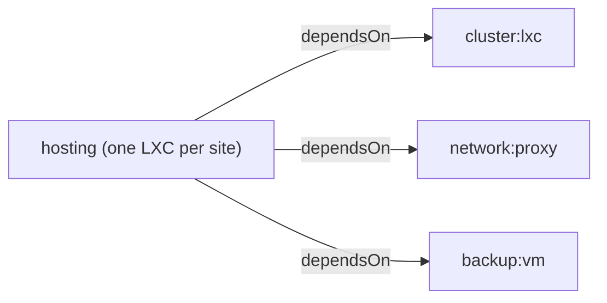

# hosting

**Version:** 0.1.0 | **Status:** Development

A generic site-hosting module for TAPPaaS. Deploys websites — from a plain
static folder to a full application stack — each as one small LXC per
site, using pluggable **templates** to define what actually runs.

## What it does

- One LXC per site instance, each fully independent (own VMID, domain,
  content, lifecycle).
- What runs inside a site is decided entirely by its **template** — the
  core module contains no template-specific logic of its own.
- Every LXC supports nested Podman containers by default, giving templates
  room to run more than just plain files.

```
Internet → OPNsense (edge, TLS) → this site's own LXC → template-specific
```

## Templates

Templates are what make this module generic: each one defines a different
kind of site (its own fields, defaults, sizing, and provisioning) as a
self-contained folder under `templates/`. Adding a new one means adding a
folder — nothing in this file, or in the core `install.sh`/`update.sh`/
`test.sh`, needs to change for that.

`new-site.sh` (below) discovers whatever templates exist automatically, so
picking one is just answering a prompt. See `templates/` for what's
currently available — each template documents itself in its own README.

## Installing a site

```bash
cd Community/src/AndreasJe/hosting
./new-site.sh
```

Prompts for a site name, then a template (pick by number), then whatever
fields that template needs — and offers to install it right away.

`new-site.sh <sitename> <template>` skips the prompts. Not public by
default — add `"proxyAllowedZones": ["internet"]` to the instance's JSON
yourself once a site is ready to go live.

**By hand instead of `new-site.sh`:**

```bash
cp hosting.json <sitename>.json
# edit: vmname, vmid, "template": "<name>", the fields that template's
#   own README documents, proxyDomain, sizing
install-module.sh <sitename>
```

## Local media

Some templates support serving media from a local folder instead of git —
required once files exceed git's practical limits (GitHub rejects any file
over 100MB). See a template's own README for support and exact behavior.

| | |
|---|---|
| Folder | `media/<template>/<sitename>/` |
| Created by | `new-site.sh`, automatically, per site |
| Referenced in site code as | `/media/<filename>` |
| Applied by | `update-module.sh <sitename>` (manual, hourly schedule, or the watcher below) |

### Getting content applied

| Transfer method | Mechanism |
|---|---|
| A shell command (`rsync`, `scp`, ...) | Chain `update-module.sh <sitename>` directly after it — immediate, no other setup |
| A tool without shell access (GUI client, sync tool) | `media-watcher.sh` detects the change and triggers the update automatically |

`media-watcher.sh` is enabled by default (`new-site.sh` sets it up on first
run). It waits for a quiet period (`MEDIA_WATCHER_QUIET_SECONDS`, default
30) with no further changes in a site's folder before triggering an update,
so a multi-file transfer produces one update rather than one per file. A
tool able to create a file, even without running a command, may create
`.sync-now` inside the site's folder to trigger the update immediately
instead of waiting.

Manual setup, if needed:

```bash
nix profile install nixpkgs#inotify-tools
mkdir -p ~/.config/systemd/user
sed "s|__HOSTING_ROOT__|$(pwd)|g" media-watcher.service > ~/.config/systemd/user/media-watcher.service
systemctl --user daemon-reload
systemctl --user enable --now media-watcher.service
loginctl enable-linger "$(whoami)"
```

## Lifecycle

```bash
install-module.sh <sitename>
update-module.sh  <sitename>
test-module.sh    <sitename>
delete-module.sh  <sitename>
```

`update-module.sh` also runs automatically on the platform's hourly
`update-tappaas` schedule — no separate in-container timer.

## Files in this directory

| File | What it is |
|---|---|
| `hosting.json` | Required core file, no `template` set — the base every new site is synthesized from. Not meant to be installed as-is. |
| `new-site.sh` | Creates a new site — see "Installing a site" above. |
| `templates/<name>/template.json` | That template's fields, defaults, and recommended sizing. |
| `<sitename>.json` | A deployed site instance. |
| `media/<template>/<sitename>/` | A site's local media folder, if its template supports one — see "Local media" below. |
| `media-watcher.sh` / `media-watcher.service` | Optional watcher that auto-triggers `update-module.sh` when a site's local media changes — see "Local media" below. |

## Debugging

What's running (and how to inspect it) depends entirely on which template
a site uses — see that template's own README.

## Module dependencies



Shared by every site regardless of template. Anything a specific template
additionally reaches outside the platform for is documented in that
template's own README.

## Security notes

| Note | Detail |
|---|---|
| Template fields aren't platform-validated | A template's own fields (nested under whatever key it picks) only trigger a harmless "unknown field" warning — validating them is that template's own job, via `lib/lxc-helpers.sh`'s shared helpers. |
| `--<field>` CLI overrides don't work for template fields | Only fields declared in the platform's schema can be set via `install-module.sh --field value`. A template's own fields need direct JSON edits. |
| `requiredFields` must never be secret-shaped | Answers are written back to plain, on-disk JSON. A template needing a secret must prompt with `read -rsp` and write straight to `/etc/secrets/<vmname>.env`, never through the normal field-writeback path. |
| `cluster:ha` doesn't support LXC yet | Current limitation, not permanent — relevant to every template here, all of which run on `cluster:lxc`. |

## Limitations

- Only templates under `templates/` are shipped.
- No changes anywhere under `src/foundation/` — pure apps-tier module.

## License

Mozilla Public License 2.0
