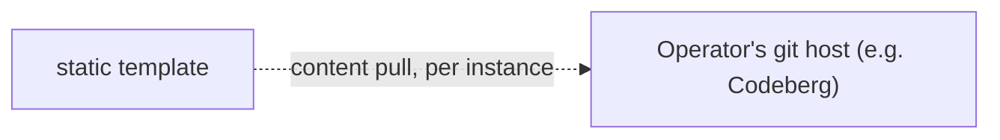

# `static` template

Serves a git-pulled folder via Caddy. No database, no app process.

```
Internet → OPNsense/Caddy (edge, TLS) → this site's Caddy → file_server → /var/www/<site>
```



## What it does

Clones `static.repo` at `static.ref` and publishes `static.subdir` into
`/var/www/<vmname>`. The git checkout itself lives outside the web root, so
`.git` is never web-reachable. `update-module.sh` (also run automatically
on the platform's hourly schedule) re-syncs content only when it changed —
no in-container timer.

## Fields

| Field | Required | Default | Notes |
|---|---|---|---|
| `static.repo` | Yes | — | Public `https://...git` URL |
| `static.ref` | No | `main` | Branch, tag, or commit SHA |
| `static.subdir` | No | `.` (repo root) | Path within the repo to publish, e.g. `dist` |

## Sizing

| cores | memory | disk |
|---|---|---|
| 1 | 512MB | 4G |

Real usage stays well under this — a static file server has no per-request
work to scale up. Raise `diskSize` if you're using local media (below) with
a lot of large files.

## Local media (required for large files)

**This isn't optional for a media-heavy site — it's how you work around
git's own limits.** GitHub (and most git hosts) reject any single file over
100MB outright, and get impractical well before that for a real photo/video
collection. If your site has more than a handful of small images, this is
the only way to serve that content from this template without a
third-party CDN.

Every site gets its own folder on this host, completely separate from its
git repo:

```
hosting/media/static/<sitename>/
```

**The process:**

1. `new-site.sh` creates this folder (empty) when you make the site, and
   tells you the exact path.
2. Move or `rsync` your media files into it yourself — nothing does this
   automatically:
   ```bash
   rsync -av ./my-photos/ media/static/<sitename>/
   ```
3. In your site's own code (in the git repo), reference those files at
   `/media/<filename>` — e.g. ``.
4. Run `install-module.sh <sitename>` (first time) or `update-module.sh
   <sitename>` (after that) to actually copy what's in that folder into the
   live site. This also happens automatically on the platform's hourly
   schedule, so a change gets picked up within the hour even if you don't
   run it yourself — but it is **not instant**: nothing inside the
   container watches this host folder, so a file only goes live when one of
   these runs actually copies it across.

Updating media later is the same three steps: replace files in the folder,
make sure the code still points at the right filenames, then update. Or set
up `media-watcher.sh` (see the main README's "Local media") to run step 4
for you automatically, shortly after you finish step 2 — no waiting for
the hourly schedule.

## Apex domain

Want this site on its own apex domain (`example.com`, not
`sitename.example.com`)? Use [`static-apex`](../static-apex/README.md)
instead — same template, different domain/TLS defaults.

## Staging

A staging site is just another instance:

```bash
cp blog.json blog-stage.json
# edit: vmname -> "blog-stage", vmid -> a free one,
#   static.ref -> the branch to preview, proxyDomain -> something internal-only
#   (don't add proxyAllowedZones: ["internet"] — keep it private)
install-module.sh blog-stage
```

## Limitations

- Public/anonymous-clone git repos only — no private-repo credentials.

## Debugging

```bash
pct exec <vmid> -- systemctl status caddy
pct exec <vmid> -- journalctl -u caddy
pct exec <vmid> -- caddy validate --config /etc/caddy/Caddyfile
```
