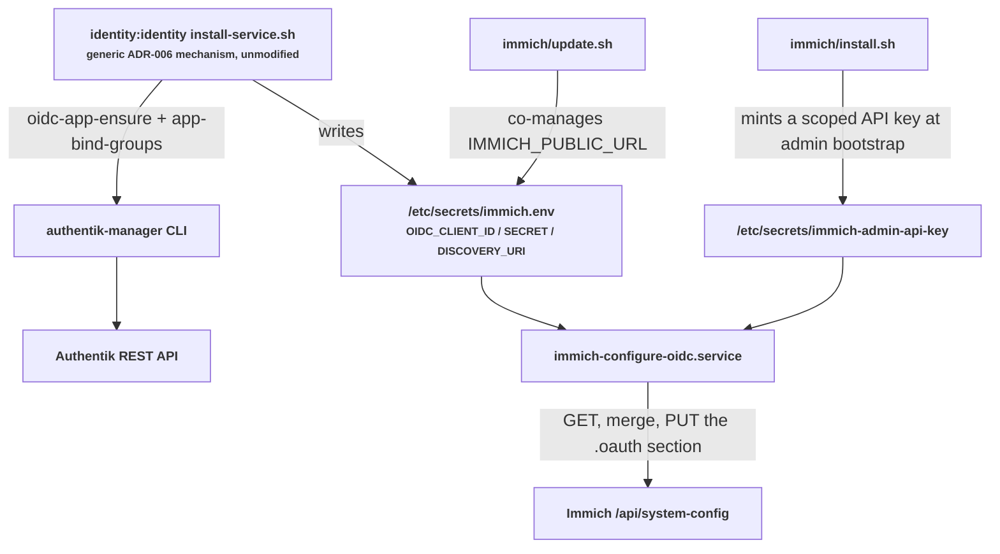
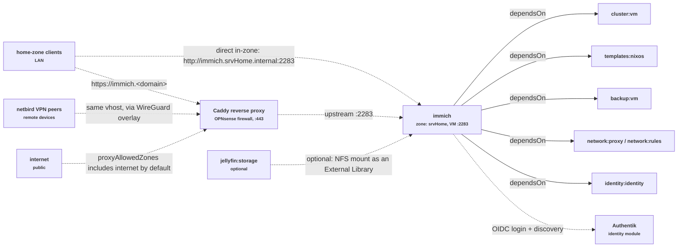

# Immich

Self-hosted photo and video backup for TAPPaaS — the private alternative to
Google Photos / iCloud Photos. Mobile auto-upload, timeline, albums, sharing,
ML-powered smart search and face recognition, all on your own hardware.

- Upstream: <https://immich.app>
- NixOS wiki: <https://wiki.nixos.org/wiki/Immich>
- License of this module: MPL-2.0 (see repository LICENSE)

## Overview

| | |
|---|---|
| VM | `immich` (VMID 351), zone `srvHome` |
| App | Immich (NixOS native `services.immich`), HTTP on port 2283 |
| Database | PostgreSQL + VectorChord — auto-provisioned by the NixOS module, unix-socket peer auth (no DB password exists) |
| Cache | Redis (named instance `immich`), unix socket |
| ML | `immich-machine-learning` on `localhost:3003` — smart search + face recognition; toggle via `machineLearning` in `immich.json` |
| TLS | Terminated by Caddy on the OPNsense firewall (`network:proxy`); the VM serves plain HTTP |
| Photos | Dedicated data disk mounted at `/var/lib/immich` (Immich's `mediaLocation`) |

## Storage Architecture

Same three-layer model as the jellyfin module, selected by `mediaStorage` in
`immich.json` (see INSTALL.md → Photo Storage):

- **Layer 1 — block device**: Proxmox virtual disk at slot `scsi2`
  (`allocate`, default 2T on `tankb1`), an operator-attached USB/iSCSI disk
  (`attached`), or a NAS share mounted directly (`share`).
- **Layer 2 — filesystem**: ext4, label `immich-data`, mounted by label at
  `/var/lib/immich` (`nofail` + systemd automount).
- **Layer 3 — Immich layout**: Immich manages its own folders there —
  `upload/`, `library/`, `thumbs/`, `encoded-video/`, `profile/`, `backups/`.

`immich-server` has `RequiresMountsFor=/var/lib/immich`: if the data disk is
missing the service fails fast (restart loop) instead of silently writing
photos to the OS disk.

## Services

- `immich-server` — API + web UI on `0.0.0.0:2283` (firewall: 22, 2283 only)
- `immich-machine-learning` — CLIP smart search, face recognition
  (`localhost:3003`; models ~1–2 GB download to `/var/cache/immich` on first
  job). Disable with `"machineLearning": false` and drop VM memory to 4096.
- `postgresql` / `redis-immich` — module-managed, no TCP listeners
- `postgresqlBackup-immich` — daily SQL dump at 02:30 (staggered after
  Immich's built-in ~02:00 dump) to `/var/backup/immich/postgresql`,
  30-day retention (monthly cleanup timer)

## Backups

Three layers:

1. **PBS** (`backup:vm`) snapshots both disks (OS + photo disk).
2. **Immich built-in**: nightly `pg_dumpall` into `/var/lib/immich/backups`
   (on the photo disk, so it rides along with PBS).
3. **postgresqlBackup**: daily plain-SQL dump (02:30) on the OS disk —
   restorable without Immich itself.

## Authentication & SSO

`install.sh` bootstraps a local admin account and prints the generated
password once (change it after first login) — this is the account of last
resort if SSO is ever broken (see Lockout recovery in INSTALL.md).

Everyone else signs in through Authentik, on web and in the mobile app,
via a **Login with OAuth** button — no separate Immich account has to be
created up front, and no manual configuration is needed in either the
Authentik or the Immich admin UI. `immich.json` depends on
`identity:identity` (ADR-006) and declares an `identity` block; every
`install-module.sh`/`update-module.sh` run reconciles the Authentik side and
applies the client credentials to Immich itself.

### How it wires together



Two things happen in parallel, both driven by `immich.json`'s `identity`
block:

1. **The Authentik side** is handled entirely by the generic
   `identity:identity` mechanism that every OIDC-native TAPPaaS module
   uses (Nextcloud included) — no module-specific code. It reads
   `identity.oidcRedirectPaths` (three plain `https://<proxyDomain><path>`
   URIs: `/auth/login`, `/user-settings`, and `/api/oauth/mobile-redirect`),
   creates/updates the OAuth2 provider and application, binds access to the
   `users` group (Authentik denies all access to an application with no
   binding, so this is applied unconditionally), and writes the resulting
   client credentials plus the discovery URL into `/etc/secrets/immich.env`
   on the VM.

   The mobile app's OAuth callback is a custom URI scheme,
   `app.immich:///oauth-callback` — that value is never registered
   anywhere directly, since neither Authentik nor Immich's own validation
   reliably accepts a non-`https` redirect URI. Immich ships a built-in
   server route, `/api/oauth/mobile-redirect`, that forwards to the custom
   scheme internally, so that plain HTTPS path is what gets registered and
   configured everywhere instead — this is Immich's own documented
   mechanism (see [Immich OAuth docs](https://docs.immich.app/administration/oauth/)),
   not something specific to this module.

2. **Immich's own side** is handled by `immich-configure-oidc.service`
   (defined in `immich.nix`). Immich has no OIDC-provider CLI comparable to
   Nextcloud's `occ user_oidc:provider` — its OAuth settings live in the
   system config, editable only through the admin UI or
   `/api/system-config` — so a declarative `services.immich.settings`
   would freeze that entire config read-only just to set OAuth. Instead,
   this service authenticates with a narrowly-scoped API key (permissions
   `systemConfig.read` + `systemConfig.update`, minted by `install.sh`
   right after admin bootstrap — the admin password itself is never
   written to disk), reads the current system config, merges in the OAuth
   fields (issuer, client credentials, scope, the mobile redirect override),
   and writes the merged document back — leaving every other setting the
   admin has tuned untouched. The issuer value is derived from the
   discovery URL and must match Authentik's own issuer string exactly,
   trailing slash included, since Immich's OIDC client validates it per
   the OIDC discovery specification.

   The mobile redirect override needs to know this module's own public
   URL, which `/etc/secrets/immich.env` doesn't otherwise carry (it only
   holds the `OIDC_*` keys the generic mechanism manages) — `update.sh`
   co-manages one additional key, `IMMICH_PUBLIC_URL`, into the same file,
   the same "co-managed keys" pattern the euro-office/nextcloud connectors
   already use, where each script only ever touches its own key(s).

Access can be narrowed beyond "every TAPPaaS login" with
`authentik-manager app-bind-groups immich --group <narrower-group>` (see
`identity-controller/README.md`), and per-user storage quotas can be wired
through an Authentik scope mapping plus `identity.scopes` in `immich.json`
— see INSTALL.md for both. Mobile installs use the same public URL and
credentials as the web app.

## Logging

Logs live in the local journal:

```bash
journalctl -u immich-server -u immich-machine-learning -f
```

Verbosity is set via `IMMICH_LOG_LEVEL` in `immich.nix` (`verbose`, `debug`,
`log`, `warn`, `error`). Central log shipping to the `logging` foundation
module (Loki) is **not** wired up: srvHome has no route to the mgmt zone
(Tier-0 accepts no inbound pinholes by design), so Tier-1 app VMs cannot push
to Loki today. When the platform provides an ingest path, the Promtail client
snippet in `TAPPaaS/src/foundation/logging/DESIGN.md` is a copy-paste job.

## Module dependencies & traffic flow



Solid arrows are declared `dependsOn` edges (install-order dependencies).
Dashed arrows are traffic: `network:proxy` creates the `immich.<domain>`
vhost on the Caddy reverse proxy, and `proxyAllowedZones` (`home`, `netbird`,
`internet` by default) controls which source zones that vhost accepts —
including the public internet, so mobile auto-upload works away from home
without a VPN. Home-zone clients can also bypass the proxy and hit the VM
directly in-zone. `immich:identity` traffic is the OIDC login/discovery
flow against Authentik, described above. The optional Jellyfin link lets a
Jellyfin media library be added as an Immich External Library over NFS.

## Future enhancements

- **Jellyfin photo library**: add `jellyfin:storage` to `dependsOn` to
  NFS-mount jellyfin's `/media` read-only (e.g. at `/media-jellyfin`), then
  add `/media-jellyfin/Photos` as an Immich *External Library* in the admin
  UI. Requires jellyfin in `allocate`/`attached` mode (NFS export active).
- **Hardware transcoding**: set `accelerationDevices` in `immich.nix` (see
  INSTALL.md → Variants).

## Quick Start

```bash
# on tappaas-cicd, from ~/Community/src/AndreasJe/immich
install-module.sh immich     # VM + disk + config + admin bootstrap
./test.sh                    # health checks
```

Then open `https://immich.<your-domain>`, log in with the printed admin
credentials, and install the mobile app.
