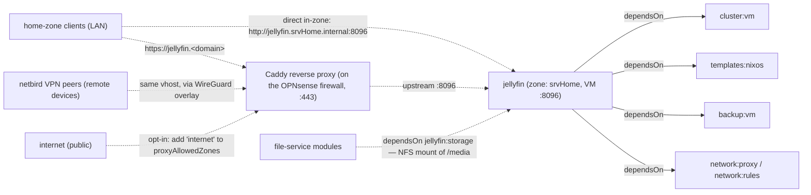

# Jellyfin

Open-source media server for personal movie, TV, music, and photo libraries.

This module is under active development (status: Development). See
[INSTALL.md](INSTALL.md) for the supported storage options and their caveats.


## Overview

| Field | Value |
|---|---|
| VM name | `jellyfin` |
| Zone | `srvHome` (VLAN 210, 10.2.10.0/24) |
| Port | 8096 |
| VM ID | 350 |
| App version | 10.10.7 |

## Storage Architecture

```
Layer 1 – Storage backend   allocate: Proxmox virtual disk · attached: iSCSI LUN / USB disk · share: NAS share
Layer 2 – Filesystem        ext4 labelled jellyfin-media, mounted at /media (share: the NAS filesystem)
Layer 3 – NFS export        /media exported to srvHome zone (allocate/attached modes only)
```

The media disk is separate from the OS disk (tanka1). In the disk modes the VM
mounts whatever block device carries the ext4 label `jellyfin-media` at
`/media`, so the backend (ZFS pool, iSCSI LUN, passed-through disk) is
swappable without touching Jellyfin. See [INSTALL.md → Media Storage](INSTALL.md#media-storage)
for the supported paths — declared via `mediaStorage` in `jellyfin.json`
(`allocate`, `attached`, or `share`) — and for post-install changes
(grow/move/replace).

## Media Folders

```
/media/
  Movies/           Jellyfin library: Movies
  TV/               Jellyfin library: Shows
  Music/            Jellyfin library: Music
  Photos/           Jellyfin library: Photos
  Audiobooks/       Jellyfin library: Books/Audiobooks
  downloads/
    complete/       File-service write target (via NFS)
    incomplete/     In-progress transfers
```

## Services

**`mediaserver`** — ensures the media storage declared by `mediaStorage` in
`jellyfin.json` is present and mounted at `/media`. `allocate`: creates and
formats a fresh virtual disk on first install (only ever formats the blank
volume it just created). `attached`: verify-only — you provide the disk and
prepare it once with `setup-media-disk.sh`, which relabels (data kept) or
formats it, always behind a confirmation prompt (default No, cancel with
Ctrl+C or Enter). `share`: `/media` is a NAS mount, verify-only. See
[INSTALL.md → Media Storage](INSTALL.md#media-storage).

**`storage`** — mounts `/media` from this VM on a dependent file-service module at `/media-jellyfin`.

A file-service module declares this dependency as:
```json
"dependsOn": ["jellyfin:storage"]
```

The media store is designed to be **shared by multiple modules**: a file-service
module writes new media to `/media-jellyfin/downloads/complete` (ownership is
normalized to the `jellyfin` user by the NFS export), and because `downloads/`
and the libraries share one filesystem, moving finished files into
`Movies/`/`TV/` is an instant rename.
Sharing always happens over NFS at the file layer — never by attaching the media
disk to a second VM. See [INSTALL.md → Media Storage](INSTALL.md#media-storage).
Whether Jellyfin's realtime library monitoring sees another module's writes
depends on which storage path serves the files — see
[INSTALL.md → Realtime library monitoring and shared storage](INSTALL.md#realtime-library-monitoring-and-shared-storage).

## Module dependencies & traffic flow



Solid arrows are declared `dependsOn` edges (install-order dependencies). Dashed
arrows are traffic: `network:proxy` creates the `jellyfin.<domain>` vhost on the
Caddy reverse proxy running on the OPNsense firewall, and `proxyAllowedZones`
(`home`, `netbird`) controls which source zones that vhost accepts — LAN clients
and VPN overlay peers by default, so remote access works without any public
exposure. Adding `"internet"` opts into the public HTTPS entry. Home-zone clients
can also bypass the proxy and hit the VM directly in-zone. The NFS export of
`/media` is a separate, zone-local path for file-service consumers declaring
`dependsOn: ["jellyfin:storage"]`.

## Quick Start

```bash
cd ~/Community/src/AndreasJe/jellyfin
install-module.sh jellyfin
```

See [INSTALL.md](INSTALL.md) for full instructions.
