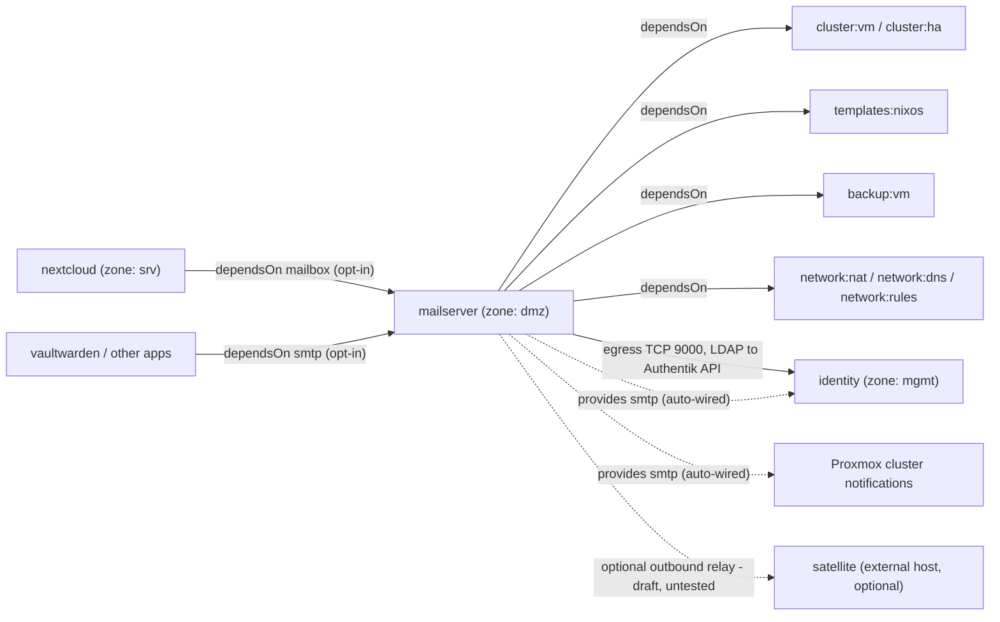
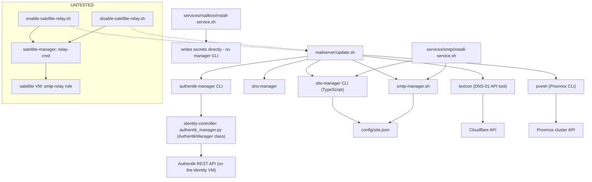

# mailserver (foundation)

Full mail stack for the site: Postfix + Dovecot + Rspamd + ClamAV + OpenDKIM
(via [simple-nixos-mailserver](https://gitlab.com/simple-nixos-mailserver/nixos-mailserver)),
authenticating against a co-located Authentik LDAP outpost. A single, shared,
mgmt-managed platform primitive — like `identity` — not a per-tenant app.
One mailserver, one login: anyone added to the `mail-users` Authentik group
gets a real mailbox under their existing Authentik password, with no
mailserver-side configuration per person.

## Module dependencies



Solid arrows are declared `dependsOn` edges (install-order dependencies).
Dashed arrows are the two capabilities `mailserver` provides — note the
direction split described below: foundation consumers get wired from
`mailserver`'s own side, app consumers opt in from theirs. The link to
`satellite` is neither — it's not in `mailserver.json`'s `dependsOn`/`egress`
at all (plain internet egress needs no new firewall rule), just an optional,
operator-triggered toggle; see "Satellite outbound relay" below.

## Featureset

| Component | Role | Use case |
|---|---|---|
| **Postfix** | SMTP — accepts inbound mail for the domain, and outbound submission from real mailboxes and other modules | The actual send/receive engine |
| **Dovecot** | IMAP/POP3 — mailbox storage and client access; also the SASL backend Postfix authenticates connections against | Where mail actually lives on disk; what a mail client talks to |
| **Authentik LDAP outpost** | Delegated login — Dovecot/Postfix bind to it instead of holding passwords themselves | One login for mail, same as everything else in TAPPaaS |
| **OpenDKIM** | Signs outbound mail with a domain DKIM key | Deliverability — receiving servers can verify the mail really came from this domain |
| **Rspamd** | Scores inbound mail for spam (and coordinates the antivirus check below) | Keeps junk out of mailboxes without a separate mail-filtering product |
| **ClamAV** | Scans inbound mail attachments for known malware | Basic virus/malware hygiene on incoming attachments |
| **ACME (Let's Encrypt)** | Issues and renews a real TLS certificate for the mail domain, via DNS-01 | Clients get a trusted cert, not a self-signed one |

### Spam and antivirus

Rspamd is the spam filter: it scores every inbound message using a
combination of checks (DNSBL lookups, header/content heuristics, DKIM/SPF/
DMARC alignment) and acts on the score — deliver, tag, or reject. ClamAV is
a separate daemon that only scans attachments for known malware signatures;
Rspamd calls into it as one of its checks rather than duplicating antivirus
logic itself, so the two work together rather than as competing filters. In
practice: a phishing email with no attachment gets caught by Rspamd's own
scoring; a legitimate-looking email carrying a malicious attachment gets
caught by the ClamAV check Rspamd triggers. Removing either narrows coverage
in a different way, which is why both ship by default rather than picking one.

### Ports

| Port | Protocol | Purpose | Forward it? |
|---|---|---|---|
| 25 | SMTP | Inbound mail delivery from other mail servers | Yes, if you want to *receive* mail from the internet |
| 465 | SMTPS (implicit TLS) | Outbound submission for clients that use implicit TLS | Yes, if any mail client needs it (most modern clients use 587 instead) |
| 587 | Submission (STARTTLS) | Outbound submission for mail clients (phones, desktop apps) | Yes, for sending mail from client devices |
| 993 | IMAPS | Mailbox access (read/search/sync) | Yes, for any IMAP client |
| 995 | POP3S | Mailbox access (download-and-delete style) | Only if you actually have a POP3 client; IMAP covers most use cases |

Plain (non-TLS) IMAP/POP3 (143/110) are deliberately not exposed — TLS-only,
per RFC 8314.

### When you need the satellite outbound relay

Forwarding port 25 makes this a fully-featured mail server — with one
caveat: your ISP has to actually allow outbound port 25 on your connection.
Many residential ISPs block it to cut down on spam from infected home
devices, independent of whatever you forward on your own router. If that's
the case for your connection, outbound mail will time out or silently queue
forever even though everything else works. See "Satellite outbound relay"
below for the fix — it's an add-on, not something every install needs.

## Core integrations

These are the module's default, everyday behaviors — not the optional
satellite add-on described later.

### Getting someone a mailbox (people-manager)

```bash
people-manager group add mail-users --displayName "Mail Users" --ownerOrg <org>   # one-time
people-manager user modify <person> --add-groups mail-users                        # the trigger
people-manager reconcile --apply                                                    # push to Authentik
```

No mailserver-side step is needed — Dovecot creates the mailbox automatically
the first time anything is delivered to it (their own enrollment email, for
instance), independent of any login.

Removing someone from `mail-users` (`user modify --remove-groups mail-users`
+ `reconcile --apply`) stops further authentication and delivery.

### Webmail (Nextcloud Mail) — `mailserver:mailbox`

Once `mailserver:mailbox` is wired to a Nextcloud install (see
`services/mailbox/README.md`), a `mail-users` member simply opens the Mail
tab in Nextcloud — no "add account" dialog, no re-entering a password. Any
other IMAP/POP3/SMTP client (phones, Thunderbird, etc.) authenticates the
normal way, using the person's real Authentik password.

### Outbound relay for other modules — `mailserver:smtp`

- **Foundation modules get `mailserver:smtp` by default — no `dependsOn`
  needed on their side.** `mailserver`'s own `update.sh` provisions the relay
  credential and directly calls each known foundation-tier consumer's
  `install-service.sh` (currently Authentik/`identity` and the Proxmox
  cluster notification target); a foundation module never has to declare the
  dependency itself.
- **`src/apps/` modules are opt-in only.** An app gets `mailserver:smtp` or
  `mailserver:mailbox` only by declaring it in its own `dependsOn` (e.g.
  Nextcloud's `nextcloud.json` lists `"mailserver:mailbox"`) — `mailserver`
  never reaches into an app module unprompted.
- **Adding a new foundation-tier consumer** means adding a call to that
  consumer's `services/smtp/install-service.sh` (or `services/mailbox/`) from
  `mailserver`'s own `update.sh`, the same way Authentik/Proxmox are wired
  today — not adding `mailserver:smtp` to the new module's `dependsOn`.

## Satellite outbound relay

Some ISPs — commonly on residential lines, occasionally on business-grade
ones too — block outbound port 25 entirely, to cut down on spam from
infected devices on their network. When that's the case, the mailserver can
send outbound mail through a small relay running on the ADR-010 `satellite`
module (an external VPS with its own public IP) instead of connecting out
directly. Confirmed for this deployment 2026-07-11: a direct `/dev/tcp`
connect test to port 25 times out while port 443 from the same host succeeds
instantly, and OPNsense's own firewall logs show the traffic `pass`ed on both
the dmz-inbound and WAN-outbound legs — the block is upstream of TAPPaaS, not
something OPNsense or the mailserver itself is doing.

**How it works:** an opt-in `"smtp-relay"` role on the satellite
(`src/foundation/satellite/satellite.nix`, `schemas/satellite-fields.json`)
runs a relay-only Postfix (Dovecot-SASL auth only, no mailboxes, no local
delivery, `smtpd_relay_restrictions = permit_sasl_authenticated, reject`)
that accepts authenticated submission from this mailserver and delivers
onward from the satellite's own datacenter IP. On the mailserver side,
`mailserver.nix` has an opt-in `outboundRelayEnabled`/`outboundRelayHost`
toggle (off by default, same placeholder-substitution convention as the
domain/dnsProvider fields above), flipped via:

```
services/smtp-relay/enable-satellite-relay.sh  <relay-hostname> [<satellite-name>]
services/smtp-relay/disable-satellite-relay.sh [<satellite-name>] [--revoke]
```

`enable-satellite-relay.sh` provisions the relay credential on the satellite
(via a `satellite-manager relay-cred add` verb — the satellite is only ever
reached through `satellite-manager`, per ADR-010 §7.3), writes the matching
secret onto this mailserver VM, flips the Nix placeholders, and re-runs
`update.sh` (which also extends the SPF record to authorize the satellite as
a sender: `v=spf1 mx a:<relay-host> ~all`). `disable-satellite-relay.sh`
reverses it back to direct-to-MX.

Only the outbound "last mile" changes — mailbox storage, IMAP, and inbound
delivery all stay on this mailserver. This is the one exception to the
pattern every other satellite role follows (reverse-proxy/admin-vpn/backup
are all designed so the satellite never sees protected content): this role's
Postfix process handles mail in the clear while relaying it — TLS protects
it only in transit, the same trade-off any commercial smarthost relay has.
Accepted for this transient-relay case (seconds, not queued indefinitely) —
see "Future work" for the fuller queue-while-home-is-down idea, a bigger,
separate trade-off.

Optional — most deployments don't need this. If a mailserver is already
hosted somewhere with clean outbound port 25 (a real datacenter rather than a
residential circuit), this mechanism stays off by default.

A security review (2026-07-11) found and fixed 6 issues before this was
written up here — most seriously, a missing `enableSubmission` that would
have made the relay accept no connections at all, and a credential briefly
exposed via `sudo`'s command logging. See the fix comments in `satellite.nix`,
`enable-satellite-relay.sh`, and `update.sh` for specifics.

**Current status:** code-complete, not yet run against a real satellite —
see "Future work" for what that needs.

## Code-level architecture (managers & controllers)

The module-level graph above is the operator's view. This is the coding
view — which scripts call which shared manager/controller packages, and what
each of those actually talks to:



What each box is, and where it lives:

- **`authentik-manager`** (`tappaas-cicd/controller/identity-controller/`) —
  Python CLI wrapping `AuthentikManager`, the single class every foundation
  module uses to provision Authentik objects (LDAP/OIDC/proxy providers,
  groups, users, RBAC roles). `mailserver` calls `ldap-provider-ensure` /
  `ldap-outpost-ensure`; `AuthentikManager` itself is plain `httpx` calls
  against Authentik's REST API, authenticated with the bootstrap Bearer token
  (`~/.authentik-credentials.txt`).
- **`site-manager`** (`tappaas-cicd/manager/site-manager/`) — TypeScript CLI,
  the single owner of `config/site.json`'s schema-validated fields (including
  the cluster-wide `smtp` block this module populates).
- **`smtp-manager.sh`** (`tappaas-cicd/scripts/`) — reads `site.json`'s
  `smtp` object and renders it into each known consumer's own file/env-var
  convention (Authentik, Nextcloud, Vaultwarden) — the "translation layer"
  between one config source and three different consumer formats.
- **`dns-manager`** — pins the mailserver VM's DHCP lease to its declared
  static IP (a real reservation, not just a DNS override).
- **`lexicon`** — third-party (not TAPPaaS-authored) DNS-API tool, invoked
  directly for pushing MX/SPF/DKIM/DMARC records; not wrapped in a TAPPaaS
  manager since it's a thin, single-purpose call.
- **`pvesh`** — Proxmox's own CLI, called directly (same reasoning as
  `lexicon`) to register the cluster notification endpoint.

`mailserver:mailbox`'s `install-service.sh` is the one path that talks to
neither manager CLI nor any external API — it only merge-writes secrets to
two VMs directly, since master-password provisioning has no external system
to reconcile against.

## Zone

`zone0: "dmz"` — the mail stack is internet-facing (inbound SMTP/IMAPS/POP3S)
so it lives in the same zone as other raw-port internet-exposed services,
not `mgmt` (no inbound pinholes by policy) and not `srv`.

## Security: authentication between modules, and where mail content actually goes

Several authentication mechanisms are in play at once here, each scoped to
the minimum it needs — not one uniform "module-to-module" credential:

| Mechanism | Used for | Who holds it | Scope |
|---|---|---|---|
| SSH key (control plane) | `tappaas-cicd` running install/update/test scripts | `tappaas-cicd` only | Orchestration only — never carries mail traffic |
| Bearer token (Authentik API) | `authentik-manager` provisioning LDAP/OIDC/proxy objects, groups, users | `tappaas-cicd` (`~/.authentik-credentials.txt`) | Authentik's admin API only — never touches mail content |
| LDAP bind (delegated auth) | Dovecot/Postfix verifying a real user's own password | Nobody but Authentik — the outpost forwards the bind to Authentik's flow executor; no password is stored on the mailserver | One user's own mailbox; the outpost itself is bound to `127.0.0.1` only |
| Shared SASL relay credential (static passdb) | Other modules submitting outbound mail (`mailserver:smtp`) | Every consumer of `mailserver:smtp` (one shared secret) | Fixed username **and** allow-listed source IP only (`username_filter` + `allow_nets`) — cannot authenticate as any real mailbox |
| Master password (static passdb) | Nextcloud webmail auto-connecting to *any* real mailbox (`mailserver:mailbox`) | The wired webmail module's VM only | Allow-listed source IP only — deliberately **not** username-restricted, since it must impersonate arbitrary real users |

**Multiple of these run concurrently for the same service, by design.**
Dovecot's authentication chain for IMAP/SMTP-AUTH tries, in order: the shared
relay credential, then the webmail master password, then real LDAP bind
against Authentik (`passdb` chaining). This is deliberate multiplexing, not
an oversight — but it means each entry's *scoping* is the actual security
boundary, not the mere existence of the chain. This build found and fixed
exactly that: the relay entry didn't correctly scope by username, so a login
attempt from an unrelated IP briefly rewrote its identity to the relay
account before falling through to LDAP. Every entry today is scoped on both
axes it should be (network **and** identity) — the property to preserve if a
new static-passdb consumer is ever added.

**A second, independent layer: network segmentation.** Credentials aren't
the only control — the zone model (`zones.json`) governs who can even attempt
a connection, regardless of what credential they'd present:

- `dmz` (this module's zone) has `access-to: [internet]` only by default —
  it cannot reach `mgmt` (identity) at all without an explicit `egress`
  exception. This module declares exactly one: TCP/9000 to identity, for the
  LDAP outpost's calls to Authentik's core API.
- `mgmt` (identity's zone) has `pinhole-allowed-from: []` — nothing can open
  an inbound connection into it, by policy, regardless of credential.
- The LDAP outpost is bound to `127.0.0.1:3389` — not reachable from any
  other host, even within the same zone. Only the co-located Dovecot/Postfix
  can reach it.

So even a leaked shared credential is bounded by who can reach the mailserver
in the first place.

**Where mail content actually goes:**

- Message content (headers + body) lives on the mailserver VM's disk, and
  only there, by default. Every protocol is TLS-only —
  `disable_plaintext_auth = yes` refuses a password before TLS is established.
- **Identity/Authentik never sees message content.** The LDAP schema
  exchanges only directory attributes for authentication (username, email,
  group membership, uid/gid) — there is no field for message bodies,
  subjects, or attachments.
- **Logging sees metadata, not content.** Promtail ships the systemd journal
  (Postfix/Dovecot/Rspamd log lines) to Loki — connection attempts, auth
  results, envelope sender/recipient, message-id, size, spam score, delivery
  status. Standard MTA/IMAP logging practice never logs full message bodies,
  and this module doesn't deviate from that.
- **Two places legitimately see real content, both opt-in:** webmail
  (`mailserver:mailbox`, if wired to a module like Nextcloud — the entire
  point of offering webmail, and why the master password must be
  broader-scoped than the relay credential), and backups (`backup:vm`,
  which snapshots the VM disk for disaster recovery — governed by PBS's own
  access controls, not anything this module configures).
- Any module using `mailserver:smtp` can only *submit* outbound messages it
  already composed itself — the relay-only scoping means it never gains read
  access to any mailbox's content.

If the goal is "mail content exists nowhere but the mailserver and its
backups," that already holds today as long as `mailserver:mailbox` is not
wired to another module — wiring it makes that module a second legitimate
place real mail content lives, by design, for the feature it provides.

## Secrets

All secrets live under `/etc/secrets/` on the mailserver VM, mode `0600`
(directories `0750`):

| File | Purpose |
|---|---|
| `mailserver-ldap.env` | Authentik LDAP outpost token |
| `mailserver-ldap-bind.pw` | Authentik LDAP outpost bind password |
| `acme-dns-credentials.env` | DNS-01 credential for the mail domain's TLS certificate |
| `mailserver-consumers.d/mailbox-<module>.env` | One file per webmail consumer's master-password credential |
| `mailserver-consumers.d/relay-shared.env` | The shared outbound relay credential, plus the list of consumer networks allowed to use it |
| `mailserver-consumers.d/relay-proxmox.env` | The Proxmox cluster notification relay credential, scoped to every cluster node's mgmt IP |
| `mailserver-smtp-relay.pw` | The same relay password as a bare value, for `site.json`'s `smtp.secretRef` (read by `smtp-manager.sh`) |

`mailserver-render-dovecot-static.service` reconciles the contents of
`mailserver-consumers.d/` into Dovecot's authentication configuration on
every boot.

## Domain configuration

`mailserver.nix` ships with an RFC 2606 reserved placeholder domain
(`invalid.example`) — the same convention as `mailserver.json`'s own
`ip: "CHANGE-ME"`: syntactically valid, so the module always builds and
activates, but obviously not a real mail domain. `update.sh` substitutes the
site's actual domain into this file in place on every
`install-module.sh`/`update-module.sh` run, resolved the same way every other
module resolves its domain. Don't hand-edit the domain in `mailserver.nix` —
the next run overwrites it.

This same substitution step is also the natural place to add multi-environment
(`--environment <name>`) support later, if a site ever needs more than one
mail domain: resolve the domain per environment instead of always reading the
site's default, and deploy one `mailserver.nix` per environment's own VM.
Nothing else about the module would need to change.

## Known limitations

- **Infra alerting via this relay is being phased out, not expanded.**
  Decided 2026-07-06: going forward, system/health alerts should centralize
  via `health-manager` reading logs, not email through `mailserver:smtp` —
  see "Future work: Alert routing" below. OPNsense was never wired this way
  and won't be now. Proxmox's cluster notification endpoint IS already
  wired (pre-existing, built before this decision) — not yet unwound;
  tracked as an open follow-up in "Future work" rather than changed here.
- DNS record publishing (MX/SPF/DKIM/DMARC) via `lexicon` is confirmed
  working end-to-end for Cloudflare; other providers should work the same
  way but may need manual verification of the pushed records or additional
  provider-specific `lexicon` env vars.
- No pre-authentication connection filter (e.g. postscreen/DNSBL) on port 25.
  Protection against abusive connections relies on Postfix's native
  per-IP connection/AUTH-rate limits and Dovecot's auth-penalty backoff.
- **Internal (LAN) clients resolve `mail.<domain>` to the wrong IP —
  confirmed bug, not yet fixed.** See
  [`docs/internal-dns-split-horizon-issue.md`](docs/internal-dns-split-horizon-issue.md)
  for the full root-cause writeup and fix options.

## Future work

### Satellite outbound relay — real-world validation

The relay described above hasn't been run against a live satellite yet.
Next step: stand up a real, cheap VPS with the `smtp-relay` role active and
run it end to end — `enable-satellite-relay.sh`, then confirm unauthenticated
submission on `:587` is rejected, an authenticated relay actually delivers, a
probe to a non-relay address (local delivery) is rejected, and the ACME
certificate on the relay hostname is valid.

### Alert routing: centralized via `health-manager` (decided, going forward)

Raised in dev-team discussion as an open architectural question; **decided
2026-07-06: centralize via `health-manager`, not direct-from-subsystem.**
Going forward, infra/health alerting should NOT be wired to email through
`mailserver:smtp` — `health-manager` (today a read-only cluster/VM/disk/
backup inspection surface, see its own README) is the intended path,
extended to watch `logging`'s events/metrics and own notification decisions
(dedup, thresholds, escalation, quiet hours) itself, rather than each
subsystem's own native alerting config emailing independently. The
previously-floated OPNsense `postfix-manager` wiring (System Notifications /
Monit alerts) is superseded by this decision and not planned.

**Pre-existing exception, not yet reconciled with this decision:** Proxmox's
cluster notification endpoint IS already wired to `mailserver:smtp` today
(`update.sh` registers a `pvesh` notification target; see
`mailserver-consumers.d/relay-proxmox.env` in the Secrets table above) —
built before this decision was made. Whether to unwind that existing wiring
(moving Proxmox alerting to `health-manager` too, once it can ingest logs) or
leave it as a deliberate carve-out is an open follow-up, not resolved by this
entry — flagging it rather than silently changing already-deployed behavior.

### Backup MX / queue-while-home-is-down — still open, separate from the relay above

The **inbound** half of the original satellite mail-relay idea (satellite as
a backup MX that queues mail if the home cluster is unreachable) remains
open/future — see `docs/design/ADR-010-implementation.md`'s Q9. A materially
bigger lift than the outbound relay above: it needs its own persistent-queue
disk sizing (no existing precedent in ADR-010's docs — current roles are all
sized "tiny"), a new DNS backup-MX record, and mail content dwelling on the
satellite for potentially hours, not the few seconds an in-flight relay holds
it.

Two mitigations already covered above don't need this role to exist:

1. **Verify actual reachability first** — an external port-25 connect test
   against the site's real public IP (both directions — inbound forwarding
   and outbound delivery are independent failure modes, confirmed the hard
   way in this deployment).
2. **DNSBL self-check** as a standing verification step (`test.sh` or
   `INSTALL.md`) — check the assigned public IP against Spamhaus PBL/SBL and
   similar lists before going live, and periodically after. Not yet built.

Residential IP ranges are also commonly listed on Spamhaus's Policy Block
List (PBL) specifically because ISPs self-declare them as "not for direct
mail" — many receiving servers will reject or heavily spam-score mail from
such a range regardless of correct SPF/DKIM/DMARC, independent of whether
port 25 itself is blocked. Reverse DNS (PTR) for a residential IP is
controlled by the ISP, not the operator — an irreducibly manual limitation
either way.
