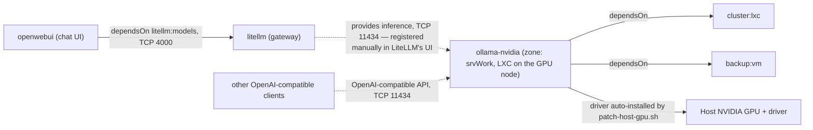

# ollama-nvidia

Primary audience: developers and services needing a local, OpenAI-compatible LLM endpoint
on NVIDIA hardware.

Local LLM inference on any NVIDIA GPU (compute capability ≥5.0) via Ollama — an
OpenAI-compatible API for LiteLLM or direct clients, with no data leaving your network.
Supports hybrid GPU+CPU layer offload, so models larger than the card's VRAM remain
usable on RAM-rich hosts. (For the engine-choice rationale — why Ollama rather than
vLLM — see [DESIGN.md](./DESIGN.md).)

## What you get

| Capability | Access from | How |
|------------|-------------|-----|
| OpenAI-compatible inference API | Internal network / consumers of `ollama-nvidia:inference` | `http://ollama-nvidia.<zone>.internal:11434` (TCP 11434 pinhole for cross-zone consumers) |
| Hybrid GPU+CPU model support | API | Models beyond the card's VRAM run (slower) via CPU offload |
| Dynamic multi-model serving | API | Multiple models pulled and swapped on demand — no single baked-in `--model` like vLLM |

Sizing guide — what fits where (Q4-quantized GGUF; rule of thumb: model weights ≈
0.55–0.65 GB per billion parameters at Q4, plus 1–3 GB for context/KV cache):

| Model class | Approx. weights | Fully GPU-resident at | Hybrid (VRAM + RAM) at | Speed |
|------|---------|----------------|----------------|-------|
| 3–4B | ~2 GB | 4 GB+ VRAM | (always fits) | Fast |
| 7–8B | ~5 GB | 8 GB+ VRAM | 4–6 GB VRAM | Fast (tens of tok/s) |
| 13–14B | ~9 GB | 12–16 GB VRAM | 8 GB VRAM | Fast–medium |
| ~30B | ~18 GB | 24 GB+ VRAM | 8–16 GB VRAM | Medium, usable interactively |
| 70B+ | ~40 GB | 48 GB+ VRAM | any card + ~48 GB free system RAM | Slow, but *possible* |

Hybrid rows require enough free *system RAM* to hold the layers that don't fit in VRAM —
that's the trade this module is designed around.

Reference models (via `./pull-model.sh`):

| Command | Model | Size (Q4) | VRAM guidance |
|---------|-------|------|------|
| `smoke` | qwen2.5:3b | ~2 GB | Fits fully on any supported card (≥8 GB floor) — quick validation |
| `prod`  | qwen2.5:14b | ~9 GB | Fully GPU-resident at 12 GB+; hybrid-offloads on 8 GB cards |
| `large` | llama3.1:70b | ~40 GB | Hybrid/CPU-heavy below 48 GB VRAM — demonstrates the offload path; needs ~48 GB free system RAM |

## What is not included

- **No model is bundled** — pull one with `./pull-model.sh` (see [INSTALL.md](./INSTALL.md)).
- **No public/internet exposure** — internal-only; cross-zone consumers get a firewall
  pinhole on port 11434 via `dependsOn ["ollama-nvidia:inference"]`.
- **No official NVIDIA/Proxmox-blessed LXC GPU passthrough path** — this uses the
  community-established pattern (device-node bind-mount + `nvidia-container-toolkit`
  inside a privileged LXC), which is less polished than AMD's `/dev/kfd` equivalent —
  driver-version drift between host and in-container userspace libs is the most common
  failure mode (see DESIGN.md).

## Requirements

- Any NVIDIA GPU with ≥8GB VRAM. Both floors are configurable in
  `ollama-nvidia.meta.json` (`min_vram_mb`, `min_driver_version`) — discovery validates
  floors, not an exact GPU model, so a GPU upgrade needs no code change. **The host
  NVIDIA driver is installed automatically** during `install-module.sh` if missing
  (pinned via `host_driver_pin` in the meta; the default favors the branch with the
  widest legacy-GPU support — bump it for newer cards). The ≥570 driver floor is what
  Ollama requires for older compute capability 5.0–6.2 cards.
- 32GB+ storage for OS + Docker + models.
- LXC sizing: use the reference formula `discover.sh` prints (cores = host cores − 8
  when >16, memory = 75% of host RAM). The defaults in `ollama-nvidia.json` reflect one
  reference host — adjust `node`, `vmid`, and sizing for your environment by copying the
  json to `/home/tappaas/config` before installing.

## Dependencies

| Depends on | Purpose |
|------------|---------|
| `cluster:lxc` | LXC container provisioning |
| `backup:vm` | Container snapshots |

## Module dependencies

Solid arrows are declared `dependsOn` edges (install-order dependencies) plus the
host-driver preparation step. Dashed arrows are consumers of the `inference`
capability: there is intentionally no `dependsOn` from `litellm` to this module — the
backend is registered in LiteLLM's UI, keeping the gateway installable on clusters
without NVIDIA hardware. Cross-zone consumers that do declare
`dependsOn ["ollama-nvidia:inference"]` get the TCP 11434 firewall pinhole auto-wired
via `services/inference/pinhole.json`; same-zone consumers need no pinhole. `cluster:ha`
is absent by design — see the note below.

**Pairing with LiteLLM**: register this backend in LiteLLM's AI Hub UI with api_base
`http://ollama-nvidia.<zone>.internal:11434` and the LiteLLM model name prefixed as
`ollama_chat/<tag>` (e.g. `ollama_chat/qwen2.5:14b`) — the prefix selects the correct
provider API; a bare tag routes through the wrong API shape and returns malformed
responses. Requires a litellm module version without a hard-coded
`vllm-amd:inference` dependency; older versions refuse to install on clusters without
AMD GPU hardware.

**No `cluster:ha`**: GPU device passthrough is node-bound — the container
binds `/dev/nvidia*` on the node that physically holds the card, so failing over to a
GPU-less node would start a container without its GPU. The container restarts with the
node (`onboot`), and consumers (LiteLLM) should treat this backend as best-effort,
falling back to their other providers when it's down.

For installation steps see [INSTALL.md](./INSTALL.md). For design rationale and the
hybrid-offload/storage decisions, see [DESIGN.md](./DESIGN.md).

## External references

- [Ollama hardware support docs](https://docs.ollama.com/gpu)
